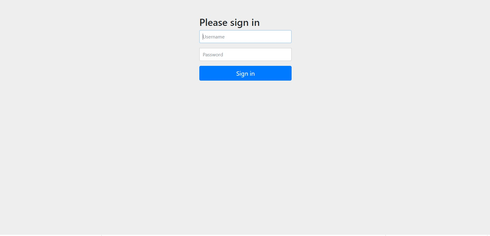
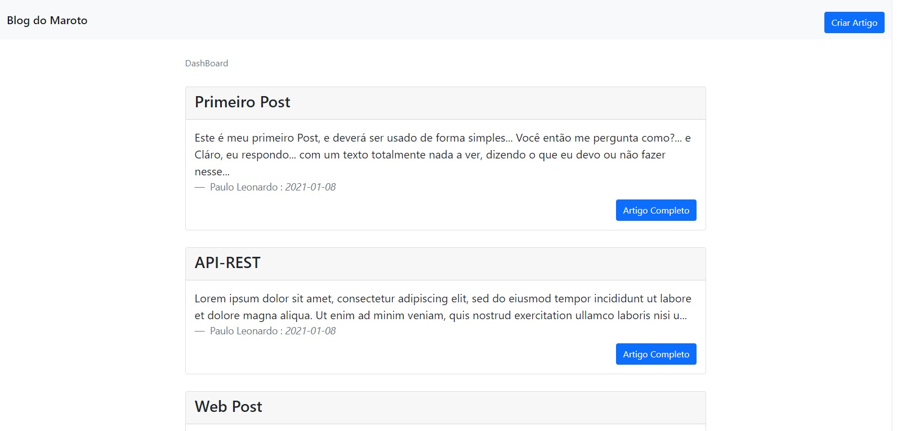
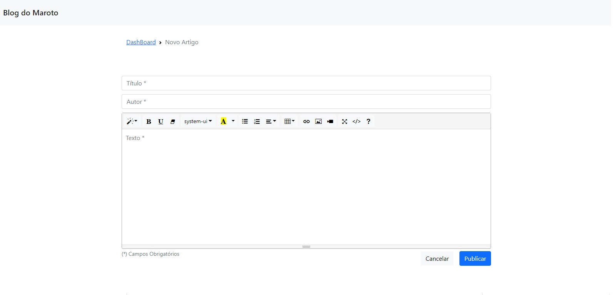
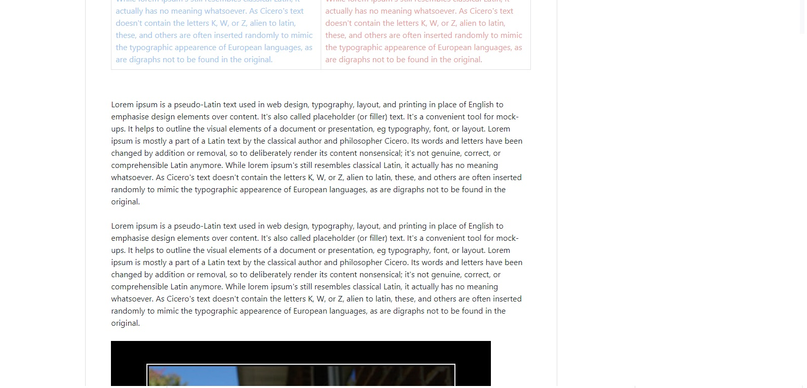

# BLOG DO MAROTO

Este projeto tem como objetivo o estudo do [Spring framework](https://spring.io/), e foi realizado
tendo como base as aulas da [Michelli Brito](https://www.youtube.com/watch?v=UdJYuwnqL3I&list=PL8iIphQOyG-AdKMQWtt1bqdVm8QUnX7_S&index=1).

Para rodar esta aplicação:
> - PostgreSQL com tabela "codeblog"
> - Login para novos Artigos (login: admin, senha: admin)

